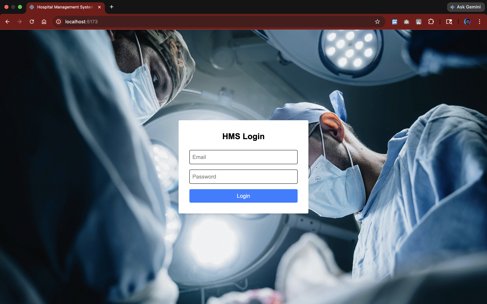
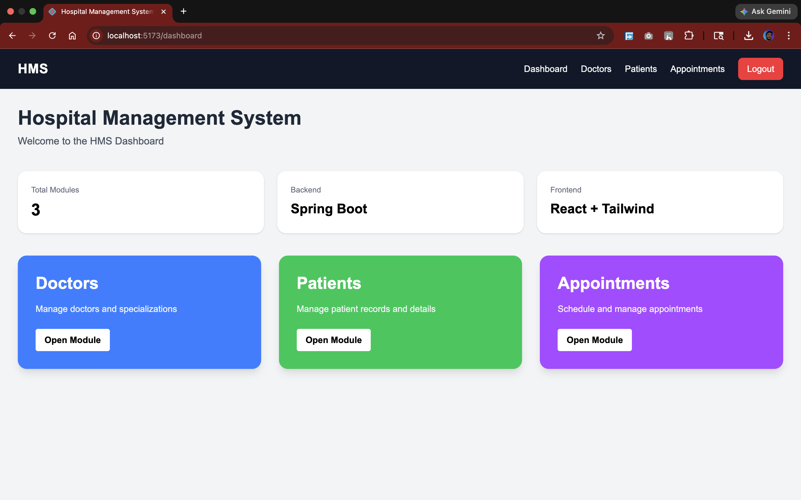
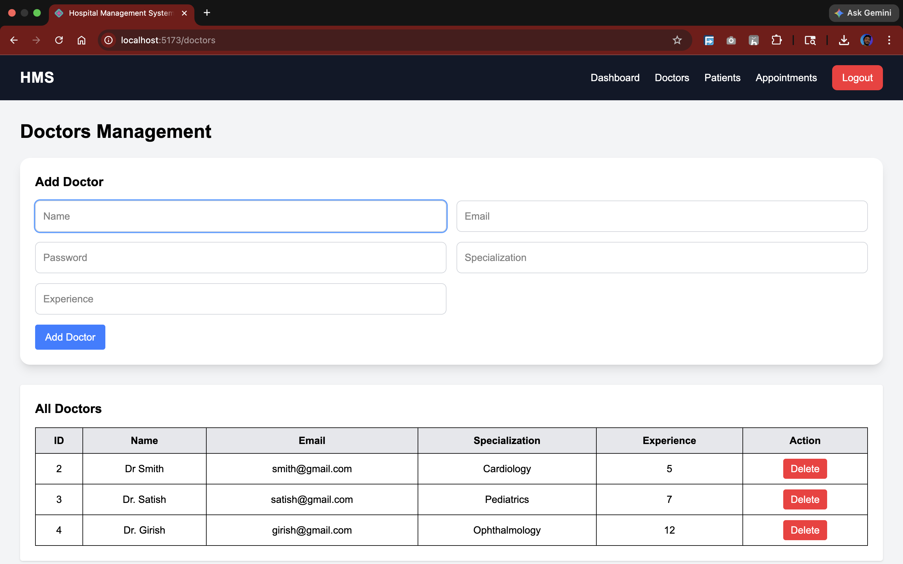
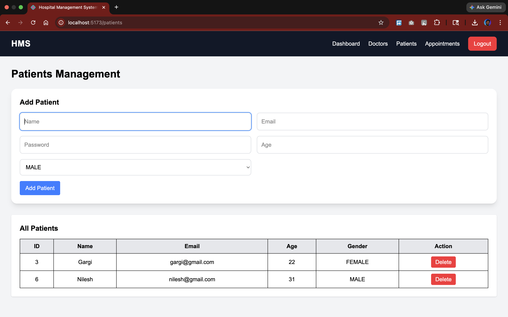
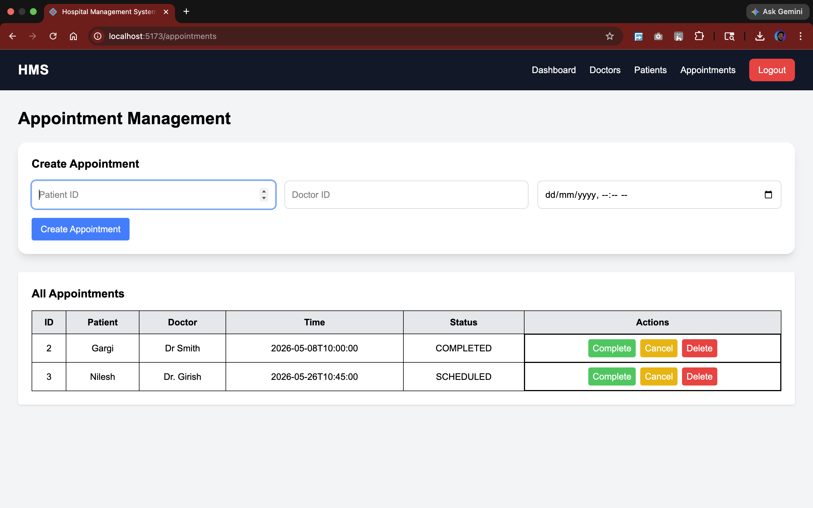
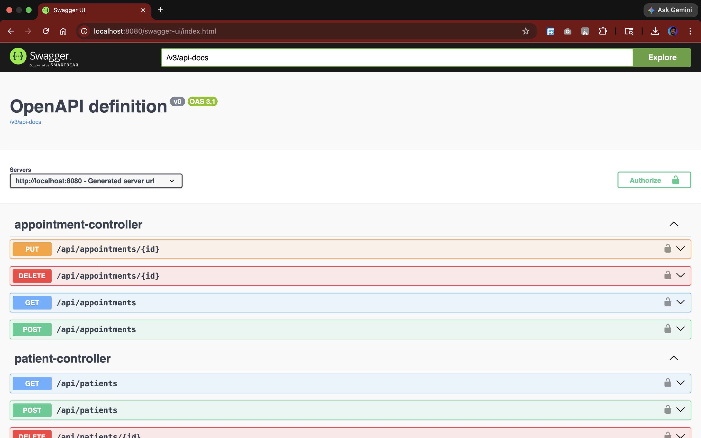
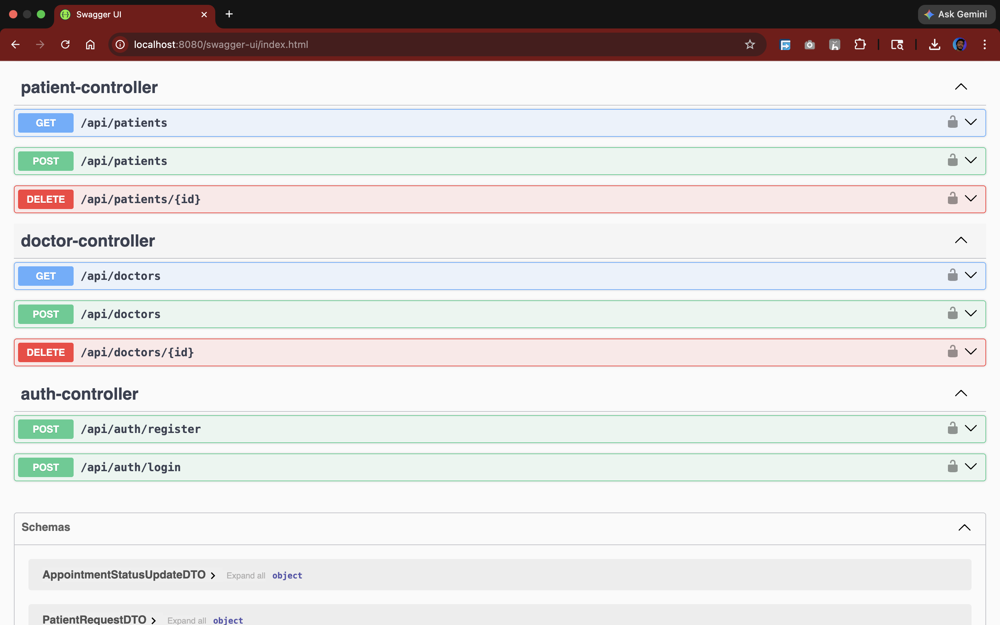

# Secure Hospital Management System

A full-stack Hospital Management System developed using Spring Boot, React, MySQL, and JWT Authentication with role-based access control.

---

# Screenshots

## Login Page


## Dashboard


## Doctors Page


## Patients Page


## Appointments Page


## Swagger UI



---

# Features

## Authentication & Security
- JWT Authentication
- Spring Security
- Role-Based Authorization
- Password Encryption using BCrypt
- Protected Routes

## Doctor Management
- Add Doctor
- View Doctors
- Delete Doctor

## Patient Management
- Add Patient
- View Patients
- Delete Patient

## Appointment Management
- Create Appointment
- Update Appointment Status
- Delete Appointment
- Prevent Double Booking

## Frontend Features
- Responsive UI
- Dashboard
- Protected Pages
- Axios API Integration

## Backend Features
- REST APIs
- Validation
- Global Exception Handling
- Swagger/OpenAPI Documentation
- Layered Architecture

---

# Tech Stack

## Backend
- Java 17
- Spring Boot
- Spring Security
- Spring Data JPA
- Hibernate
- JWT
- MySQL
- Maven

## Frontend
- React
- Vite
- Tailwind CSS
- Axios
- React Router

---

# Project Structure

## Backend Structure

```text
com.hms

├── controller
├── service
├── repository
├── entity
├── dto
├── security
├── exception
├── config
└── enums
```

## Frontend Structure

```text
src/

├── api
├── components
├── pages
└── routes
```

---

# API Endpoints

## Authentication APIs

| Method | Endpoint |
|---|---|
| POST | /api/auth/register |
| POST | /api/auth/login |

## Doctor APIs

| Method | Endpoint |
|---|---|
| POST | /api/doctors |
| GET | /api/doctors |
| DELETE | /api/doctors/{id} |

## Patient APIs

| Method | Endpoint |
|---|---|
| POST | /api/patients |
| GET | /api/patients |
| DELETE | /api/patients/{id} |

## Appointment APIs

| Method | Endpoint |
|---|---|
| POST | /api/appointments |
| GET | /api/appointments |
| PUT | /api/appointments/{id} |
| DELETE | /api/appointments/{id} |

---

# Database Design

## Tables
- users
- doctors
- patients
- appointments

---

# JWT Authentication Flow

1. User logs in
2. Backend validates credentials
3. JWT token is generated
4. Token stored in localStorage
5. Token sent in Authorization header
6. Backend validates token for protected APIs

---

# Swagger Documentation

Swagger UI URL:

```text
http://localhost:8080/swagger-ui/index.html
```

---

# Installation & Setup

# Backend Setup

## Clone Repository

```bash
git clone <repository-url>
```

## Configure Database

Update `application.properties`

```properties
spring.datasource.url=jdbc:mysql://localhost:3306/hms
spring.datasource.username=root
spring.datasource.password=yourpassword
```

## Run Backend

```bash
mvn spring-boot:run
```

---

# Frontend Setup

## Install Dependencies

```bash
npm install
```

## Run Frontend

```bash
npm run dev
```

Frontend URL:

```text
http://localhost:5173
```

---

# Future Enhancements

- Pagination
- Search & Filtering
- Email Notifications
- Docker Deployment
- Cloud Deployment
- Unit Testing

---

# Author

Sarvesh Yeutkar

M.Tech CSE (Information Security)  
College of Engineering Pune (COEP)
